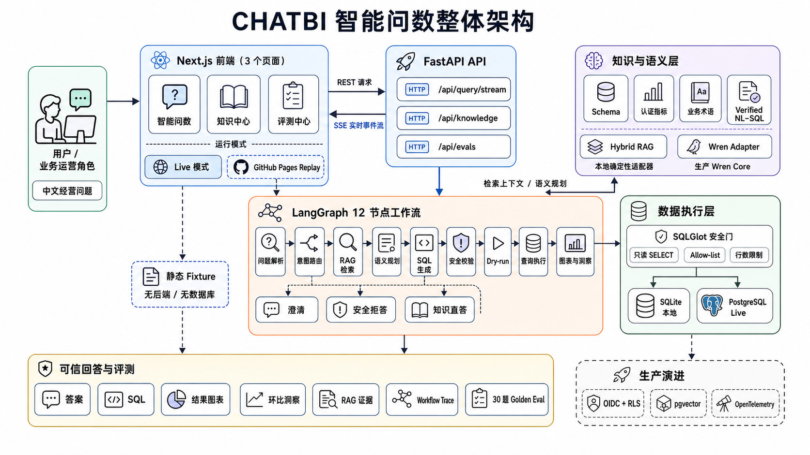

# CHATBI Portfolio Sprint MVP

A four-day, portfolio-grade conversational BI MVP for business operators who need certified metrics without SQL. The current implementation provides a real vertical slice: Next.js UI → FastAPI/SSE → LangGraph workflow → hybrid knowledge retrieval / Wren adapter → SQLGlot safety → PostgreSQL (plus SQLite local fallback).

The cloud PostgreSQL instance now also contains an isolated Olist warehouse contract and loaded anonymized public data. See [`docs/13-olist-warehouse.md`](docs/13-olist-warehouse.md) for the raw → Mart layers, import command, metric boundary, and inventory limitation. Set `CHATBI_DATA_PROFILE=olist` only after pointing Live mode at that database; the default `demo` profile remains the deterministic local/replay path.

## Architecture overview



The current implementation and its production-evolution boundary are shown together: Live mode traverses the API, workflow, context/semantic, safety, and database layers; GitHub Pages Replay reads static fixtures without a backend or database. A comparison with related open-source systems and public Text-to-SQL datasets is available in [`docs/11-related-projects-and-datasets.md`](docs/11-related-projects-and-datasets.md).

## Current status (business semantic expansion)

- **Implemented:** real node-level SSE trace, metric and knowledge-answer paths, ambiguity/safety/off-domain failures with trace, comparison insights, searchable knowledge/evaluation centers, and GitHub Pages replay fixtures. The local semantic layer is now catalog-driven rather than question-branch-driven.
- **Business coverage:** 16 certified metrics across transaction health, marketing acquisition, and inventory operations; arbitrary rolling-day windows; composable dimensions and filters; database-discovered low-cardinality values; 45 Golden questions.
- **Measured:** 45/45 Golden cases pass in the deterministic SQLite/local-adapter environment; clarification success and safety rejection are 100%, retrieval hit@5 is 100%, and MRR is 0.9829. See `evals/results/day4-business-2026-08-29.json`.
- **Still simplified:** local deterministic retrieval features, governed catalog SQL templates, deterministic insight/chart selection, and non-production synthetic data.
- **Design-only:** production identity/RLS, pgvector ingestion and release management, production Wren deployment, OpenTelemetry export, and cloud rollout. See `docs/10-production-readiness.md`.

The extension model, supported business questions, and instructions for adding a new metric or domain are documented in [`docs/12-business-semantic-expansion.md`](docs/12-business-semantic-expansion.md). The Olist integration and cloud-side Mart contract are documented in [`docs/13-olist-warehouse.md`](docs/13-olist-warehouse.md).

For the consolidated project positioning, Olist-based attribution boundary, end-to-end chain, and page-level UI roadmap, see [`docs/17-project-consolidation-and-ui-roadmap.md`](docs/17-project-consolidation-and-ui-roadmap.md). The project can deliver certified order analytics and MQL-to-closed-deal source-funnel attribution without pretending to have real inventory, ad spend, ROAS, or causal lift data.

The business-first UI keeps RAG hits, SQL, and node-level Trace behind an optional verification panel. To run the API-backed Live page locally, see [`docs/18-live-mode-and-api.md`](docs/18-live-mode-and-api.md).

## Excel / CSV data-source MVP

Live mode now uses one unified **智能问数** home page: connect an `.xlsx` or `.csv`, inspect the detected sheets, fields, types and preview rows, select that dataset, and ask a natural-language question without leaving the page. CHATBI generates dataset-specific starter questions and supports controlled totals, averages, counts, grouped comparisons, rankings and date trends. The existing commerce model remains the built-in certified demo template.

Uploaded source files are not kept. Normalized rows and profiling metadata are written to the gitignored local `chatbi_datasets.db` by default; set `CHATBI_DATASET_DB` to another local path if needed. Uploads are available only in Live mode because GitHub Pages Replay has no backend. See [`docs/19-excel-data-source-mvp.md`](docs/19-excel-data-source-mvp.md) for the workflow, limits, API contract and current boundary.

## Day 1 status

- **Implemented:** synthetic commerce schema and seed data, four knowledge classes, keyword + hashed-vector hybrid retrieval with trace, deterministic graph workflow, replaceable Wren adapter, SQLGlot validation, read-only execution, one repair attempt, query API, replay fixture, three-page UI shell, tests.
- **Simplified:** embeddings are local deterministic feature hashing; the local Wren adapter plans certified metrics when no Wren endpoint is configured; chart and insight generation are deterministic.
- **Design-only:** production Wren deployment details, enterprise authorization/RLS, knowledge publishing/versioning, distributed tracing, cloud deployment.

These labels are kept in repository documentation and code comments only; the product UI does not expose delivery-status labels.

## One-command local development (tunneled Tencent Cloud PostgreSQL)

After the first setup, use the idempotent PowerShell launcher so the SSH tunnel, API, and frontend do not need to be configured repeatedly:

```powershell
.\scripts\start-local.ps1
```

The one-time setup is `.\scripts\setup-local.ps1`; diagnostics are `.\scripts\check-local.ps1`; stop everything with `.\scripts\stop-local.ps1`. See [`docs/09-local-environment.md`](docs/09-local-environment.md). The tunnel keeps PostgreSQL bound to the server loopback interface and never opens database port 5432 publicly.
## Run locally without Docker

Python 3.11–3.13 is recommended (the project also avoids version-specific features).

```bash
python -m venv .venv
.venv/Scripts/activate
pip install -r backend/requirements.txt
python -m backend.scripts.seed_sqlite
uvicorn backend.app.main:app --reload --port 8000
```

In another terminal:

```bash
cd frontend
npm install
npm run dev
```

Open <http://localhost:3000>. The home page contains the complete connect → ask → result flow. The default question is “最近 30 天 GMV 是多少？”, and a small downloadable CSV is included for trying the upload flow. The old `/data-sources` URL remains as a compatibility alias for existing bookmarks.

## Run with Docker Compose

```bash
copy .env.example .env
docker compose up --build
```

Open <http://localhost:3000>; API health is <http://localhost:8000/api/health>.

## Static GitHub Pages replay

```bash
cd frontend
npm install
npm run build:replay
```

The static export is written to `frontend/out`. The replay mode reads checked-in fixtures and never attempts to deploy or call a real backend.

## Validation

```bash
pytest backend/tests -q
```

Architecture and delivery evidence live in [`docs/`](docs/); the Golden set lives in [`evals/golden_questions.json`](evals/golden_questions.json).

## Security

Only read-only `SELECT` statements over allow-listed analytics tables pass the SQLGlot gate. Row limits, statement count, forbidden functions, comments, and DDL/DML are checked before dry-run and execution. No secret is stored in the repository. Before any later Tencent Cloud deployment, restrict security-group source ranges—do not leave database/application/admin ports open to all IPv4.

